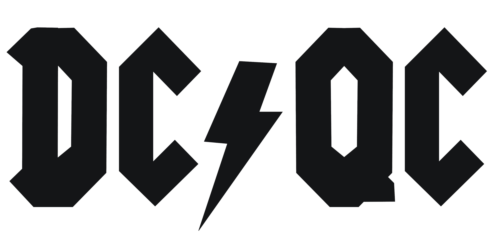
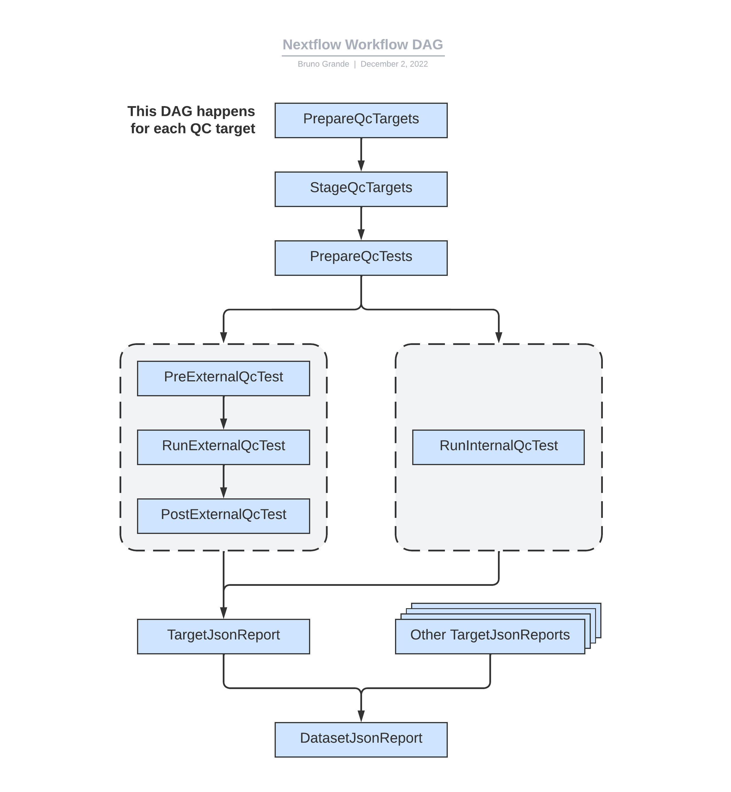
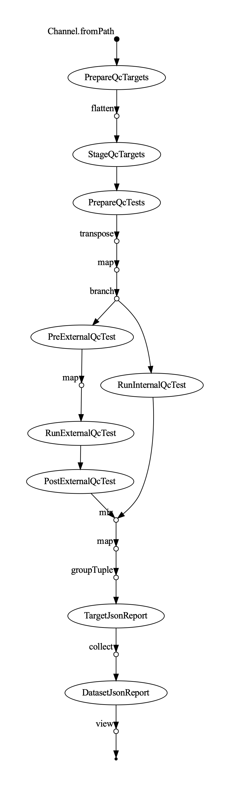
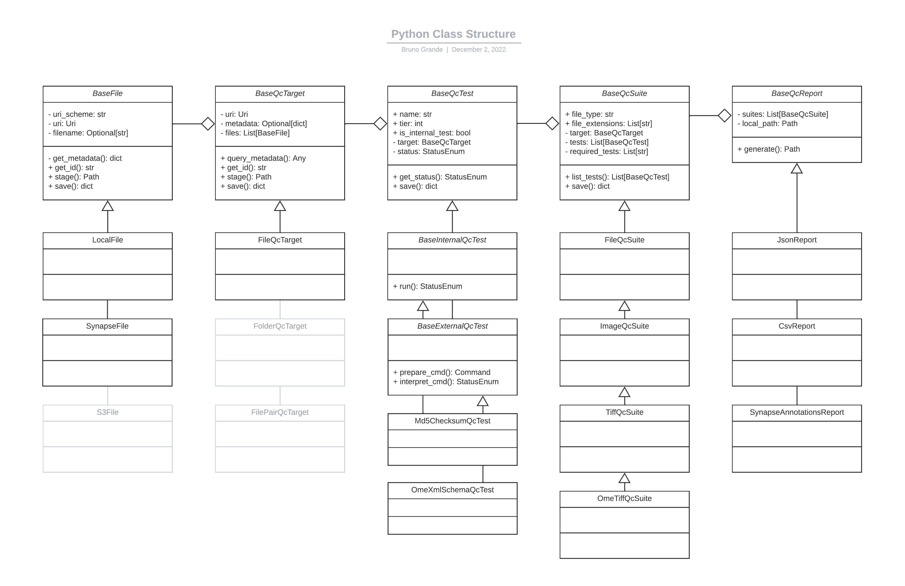

# Data Coordination Quality Control - Proof of Concept



This repository contains a proof of concept (POC) that demonstrates how a Nextflow workflow can be orchestrated by a Python script. The Python code determines which QC tests need to happen for each file based on its type and "queues" them up in Nextflow. Some of these tests are performed in Python, whereas others are achieved by interpreting log files from externally executed commands. In both cases, the Python script collates the test results into JSON reports at the file and dataset level.

## Quick Usage

### Test Command

You first need access to the Synapse files listed in `data/input_all.csv`. Then, you can run the following command after cloning the repository: 

```console
nextflow run main.nf -profile test_all,docker
```

### Test Console Output

```console
$ nextflow run main.nf -profile test_all,docker

N E X T F L O W  ~  version 22.11.1-edge
Launching `main.nf` [suspicious_church] DSL2 - revision: 16c3716635
executor >  local (50)
[9c/83296d] process > PrepareQcTargets (1)   [100%] 1 of 1 ✔
[4a/4a1615] process > StageQcTargets (1)     [100%] 6 of 6 ✔
[7d/166e2c] process > PrepareQcTests (6)     [100%] 6 of 6 ✔
[65/2171c3] process > RunInternalQcTest (12) [100%] 12 of 12 ✔
[4c/c024aa] process > PreExternalQcTest (6)  [100%] 6 of 6 ✔
[47/fb2c40] process > RunExternalQcTest (6)  [100%] 6 of 6 ✔
[b2/eef65b] process > PostExternalQcTest (6) [100%] 6 of 6 ✔
[c5/0180f4] process > TargetJsonReport (6)   [100%] 6 of 6 ✔
[86/b26663] process > DatasetJsonReport      [100%] 1 of 1 ✔
/Users/bgrande/Repos/dcqc-poc/work/86/b26663fabf0c9bb0dd95259c6a7105/dataset.qc_report.json
Completed at: 01-Dec-2022 22:39:24
Duration    : 1m 41s
CPU hours   : 0.1
Succeeded   : 50
```

### Test JSON Report

<details>

<summary>Click here to see example JSON report</summary>

```json
[
  {
    "target": {
      "type": "FileQcTarget",
      "uri": "syn://syn26644414",
      "metadata": {
        "file_type": "ome.tif",
        "md5_checksum": "0a3d8f1d2d69f15aeccedea0d54efa6c"
      },
      "files": [
        {
          "uri": "syn://syn26644414",
          "type": "SynapseFile",
          "version": 1,
          "filename": "HTMA402_2-001.ome.tif",
          "synapse_id": "syn26644414"
        }
      ]
    },
    "summary_status": {
      "required_tests": [
        "FileExtensionQcTest",
        "LibTiffInfoQcTest",
        "Md5ChecksumQcTest",
        "OmeXmlSchemaQcTest"
      ],
      "status": false
    },
    "tests": [
      {
        "type": "FileExtensionQcTest",
        "config": {
          "file_extensions": [
            ".ome.tif",
            ".ome.tiff"
          ]
        },
        "tier": 1,
        "is_internal_test": true,
        "status": true
      },
      {
        "type": "LibTiffInfoQcTest",
        "config": {},
        "tier": 2,
        "is_internal_test": false,
        "status": false
      },
      {
        "type": "Md5ChecksumQcTest",
        "config": {},
        "tier": 1,
        "is_internal_test": true,
        "status": true
      },
      {
        "type": "OmeXmlSchemaQcTest",
        "config": {},
        "tier": 2,
        "is_internal_test": false,
        "status": false
      }
    ]
  },
  {
    "target": {
      "type": "FileQcTarget",
      "uri": "syn://syn26644421",
      "metadata": {
        "file_type": "ome.tif",
        "md5_checksum": "313257a6822ff5b52e7e35a626b6c33f"
      },
      "files": [
        {
          "uri": "syn://syn26644421",
          "type": "SynapseFile",
          "version": 1,
          "filename": "HTMA402_2-003.ome.tif",
          "synapse_id": "syn26644421"
        }
      ]
    },
    "summary_status": {
      "required_tests": [
        "FileExtensionQcTest",
        "LibTiffInfoQcTest",
        "Md5ChecksumQcTest",
        "OmeXmlSchemaQcTest"
      ],
      "status": false
    },
    "tests": [
      {
        "type": "FileExtensionQcTest",
        "config": {
          "file_extensions": [
            ".ome.tif",
            ".ome.tiff"
          ]
        },
        "tier": 1,
        "is_internal_test": true,
        "status": true
      },
      {
        "type": "LibTiffInfoQcTest",
        "config": {},
        "tier": 2,
        "is_internal_test": false,
        "status": false
      },
      {
        "type": "Md5ChecksumQcTest",
        "config": {},
        "tier": 1,
        "is_internal_test": true,
        "status": true
      },
      {
        "type": "OmeXmlSchemaQcTest",
        "config": {},
        "tier": 2,
        "is_internal_test": false,
        "status": false
      }
    ]
  },
  {
    "target": {
      "type": "FileQcTarget",
      "uri": "syn://syn41864974",
      "metadata": {
        "file_type": "txt",
        "md5_checksum": "38b86a456d1f441008986c6f798d5ef9"
      },
      "files": [
        {
          "uri": "syn://syn41864974",
          "type": "SynapseFile",
          "version": 6,
          "filename": "newline.txt",
          "synapse_id": "syn41864974"
        }
      ]
    },
    "summary_status": {
      "required_tests": [
        "FileExtensionQcTest",
        "Md5ChecksumQcTest"
      ],
      "status": true
    },
    "tests": [
      {
        "type": "FileExtensionQcTest",
        "config": {
          "file_extensions": [
            ".txt"
          ]
        },
        "tier": 1,
        "is_internal_test": true,
        "status": true
      },
      {
        "type": "Md5ChecksumQcTest",
        "config": {},
        "tier": 1,
        "is_internal_test": true,
        "status": true
      }
    ]
  },
  {
    "target": {
      "type": "FileQcTarget",
      "uri": "syn://syn41864977",
      "metadata": {
        "file_type": "txt",
        "md5_checksum": "a542e9b744bedcfd874129ab0f98c4ff"
      },
      "files": [
        {
          "uri": "syn://syn41864977",
          "type": "SynapseFile",
          "version": 1,
          "filename": "no-newline.txt",
          "synapse_id": "syn41864977"
        }
      ]
    },
    "summary_status": {
      "required_tests": [
        "FileExtensionQcTest",
        "Md5ChecksumQcTest"
      ],
      "status": true
    },
    "tests": [
      {
        "type": "FileExtensionQcTest",
        "config": {
          "file_extensions": [
            ".txt"
          ]
        },
        "tier": 1,
        "is_internal_test": true,
        "status": true
      },
      {
        "type": "Md5ChecksumQcTest",
        "config": {},
        "tier": 1,
        "is_internal_test": true,
        "status": true
      }
    ]
  },
  {
    "target": {
      "type": "FileQcTarget",
      "uri": "syn://syn43716055",
      "metadata": {
        "file_type": "tif",
        "md5_checksum": "38b86a456d1f441008986c6f798d5ef9"
      },
      "files": [
        {
          "uri": "syn://syn43716055",
          "type": "SynapseFile",
          "version": 1,
          "filename": "new line.txt",
          "synapse_id": "syn43716055"
        }
      ]
    },
    "summary_status": {
      "required_tests": [
        "FileExtensionQcTest",
        "LibTiffInfoQcTest",
        "Md5ChecksumQcTest"
      ],
      "status": false
    },
    "tests": [
      {
        "type": "FileExtensionQcTest",
        "config": {
          "file_extensions": [
            ".tif",
            ".tiff"
          ]
        },
        "tier": 1,
        "is_internal_test": true,
        "status": false
      },
      {
        "type": "LibTiffInfoQcTest",
        "config": {},
        "tier": 2,
        "is_internal_test": false,
        "status": false
      },
      {
        "type": "Md5ChecksumQcTest",
        "config": {},
        "tier": 1,
        "is_internal_test": true,
        "status": true
      }
    ]
  },
  {
    "target": {
      "type": "FileQcTarget",
      "uri": "syn://syn43716711",
      "metadata": {
        "file_type": "tif",
        "md5_checksum": "a542e9b744bedcfd874129ab0f98c4ff"
      },
      "files": [
        {
          "uri": "syn://syn43716711",
          "type": "SynapseFile",
          "version": 1,
          "filename": "no newline.txt",
          "synapse_id": "syn43716711"
        }
      ]
    },
    "summary_status": {
      "required_tests": [
        "FileExtensionQcTest",
        "LibTiffInfoQcTest",
        "Md5ChecksumQcTest"
      ],
      "status": false
    },
    "tests": [
      {
        "type": "FileExtensionQcTest",
        "config": {
          "file_extensions": [
            ".tif",
            ".tiff"
          ]
        },
        "tier": 1,
        "is_internal_test": true,
        "status": false
      },
      {
        "type": "LibTiffInfoQcTest",
        "config": {},
        "tier": 2,
        "is_internal_test": false,
        "status": false
      },
      {
        "type": "Md5ChecksumQcTest",
        "config": {},
        "tier": 1,
        "is_internal_test": true,
        "status": true
      }
    ]
  }
]
```

</details>

## Design

### High-level Decisions

- **Nextflow Workflow**
  - Many QC tests will require the output from one or more commands using external (_i.e._ non-Python) programs. While we can run external commands in Python (_e.g. using the `subprocess` module), we want to avoid re-inventing a workflow management system (WMS). Instead, we should leverage an existing WMS. For the purposes of this POC, we opted for Nextflow since we have the compute infrastructure set up. That said, a future iteration could use the Common Workflow Language (whose reference implementation is in Python) and/or the Task Execution Service (TES).
  - Given that Nextflow supports arbitrary Groovy/Java code, we could technically accomplish all of the work in Nextflow alone. However, it makes a lot more sense to use a programming language that our team (_i.e._ DPE) is familiar with and that people outside of our team can readily contribute to. Python fits the bill. Hence, we are currently building a Python-Nextflow hybrid tool. 
  - In Nextflow, the `container` directive and the `script` block can leverage values provided as inputs (_e.g._ `container "${some_input}"`). This functionality allows us to keep the Nextflow workflow very general. Otherwise, we would have to hard-code the containers and commands in the Nextflow workflow and somehow keep everything in sync with the Python package, which takes care of interpreting the commands.
  - The Nextflow workflow makes use of a short `parseJson()` Groovy function to parse the contents of a JSON file into a Nextflow channel. This helps bridge the gap between Python-based processes and Nextflow since Nextflow cannot easily handle multiple outputs that are not files (_e.g._ stdout), especially when the output is intended to be structured.
- **Python Package**
  - I use the term "QC target" to refer to any combination of files and folders that represent a type of data and can be validated as a group. As a starting point, we are focusing on single files, so "QC target" and "QC file" can be used interchangeably. However, we will quickly run into multi-file QC targets, such as FASTQ file pairs and BAM/CRAM files with their indices.
  - Almost every class has a `to_dict()` method to generate a dictionary representation of an instance of that class. This is used primarily to serialize the objects to JSON between steps in the Nextflow workflow. Ideally, the Python package can deserialize these JSON files into the appropriate set of objects.
  - In the current version, I distinguish between internal and external tests. This is used to separate tests into two branches in the Nextflow DAG.
  - The QC suite is intended to represent the set of tests that are relevant to each file type. This approach might need to be re-engineered a bit to accommodate multi-file QC targets though. I'm also using inheritance to accumulate additional QC tests. For example, the OME-TIFF QC suite has OME-specific tests in addition to those inherited from the TIFF QC suite, which in turn inherits from the generic file QC suite (with basic tests like MD5 checksum validation).

### Caveats

- The pipeline currently uses container images on Docker Hub, which might be affected by rate limits.
- Currently, the Nextflow workflow is set up to run the external command(s) in one process, which means that we are limited to a single container. While we should be able to run multiple commands, if they require different programs, we could either build a composite/mulled containers, refactor the Nextflow workflow to allow for an arbitrary number of steps, or run a WMS (_e.g._ cwltool) within a Nextflow process. Depending on how common this need is, we can decide on which solution is most appropriate. For example, if it's a rare occurrence, then composite/mulled containers would be a reasonable approach.
- Special care is taken to make sure that the file names are unique in order to avoid name clashes during the two aggregation processes at the end of the workflow. Currently, this involves naming files based on the Synapse ID and the QC test name, but this doesn't generalize well. For example, what would take the place of the Synapse ID in the case of a HTTPS file? Perhaps the unique identifiers can be the index of the data file in the input CSV file (_i.e._ the row number).

### Future Directions

- For now, the workflow is focusing on QC status (_i.e._ `pass`, `fail`, and `skip`). In the future, we can look into generating QC metrics and even build those into the relevant data models so the metrics can be captured as metadata. This may involve leveraging MultiQC.
- We cannot leverage jobs cached by Nextflow because we cannot rely on intermediate files being stored indefinitely. Hence, we need to build in a separate method for skipping files that have already been QC'ed.
- Currently, Synapse will be the main repository where files are being staged from, but we can imagine that files could be obtained from HTTP(S)/FTP URLs as well as S3 buckets.
- Some QC tests require additional information. For example, the MD5 checksum test requires a checksum to compare against. We should ideally leverage data models to capture this information, including any constraints on valid values. We could use schematic here, which would also be useful to generate an input CSV template for users to fill in depending on which QC tests they wish to run.

## Diagrams

### Conceptual Workflow DAG

<p align="center">
  
</p>

### Auto-Generated Workflow DAG

<p align="center">
  
</p>

### Python Class Structure

<p align="center">
  
</p>
